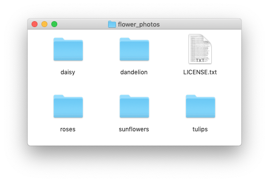
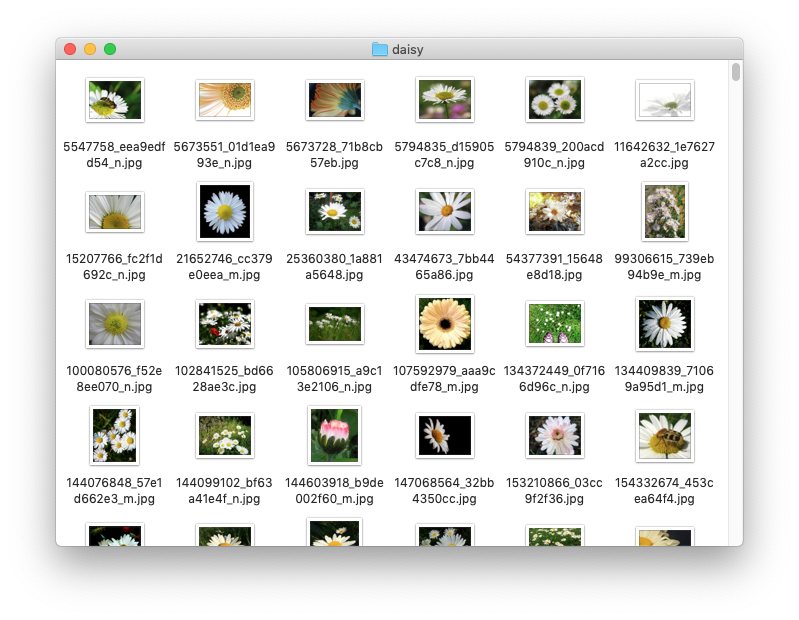
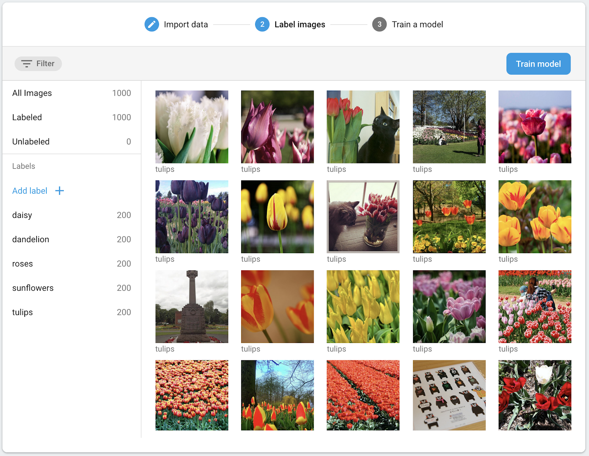
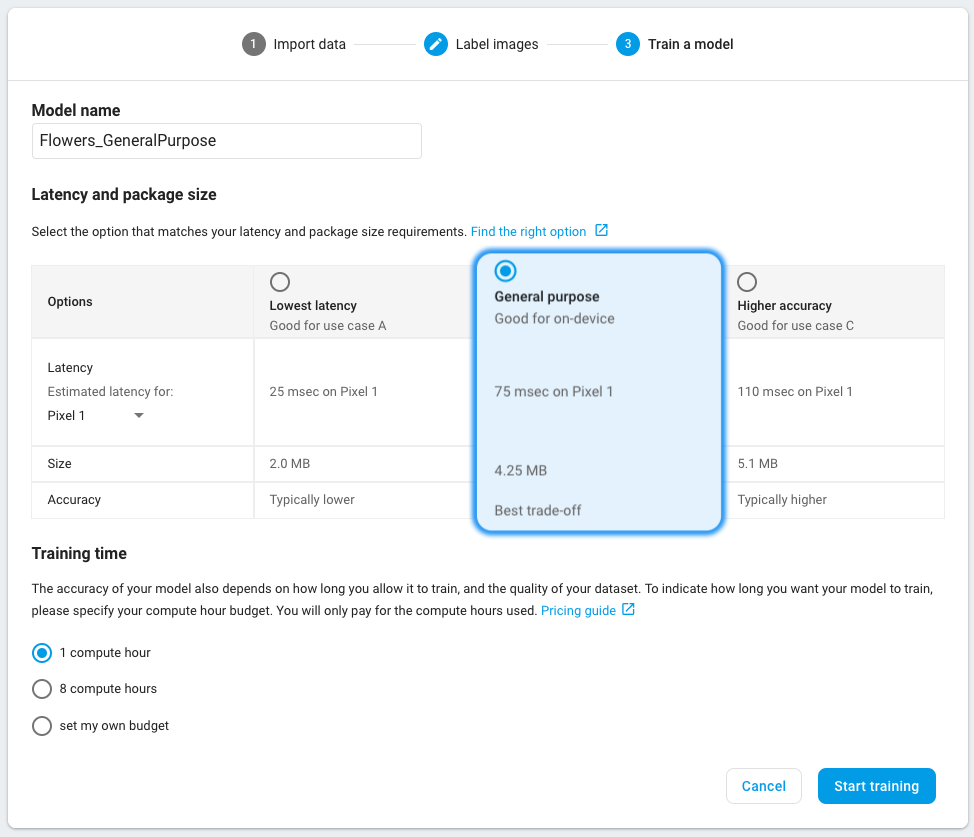
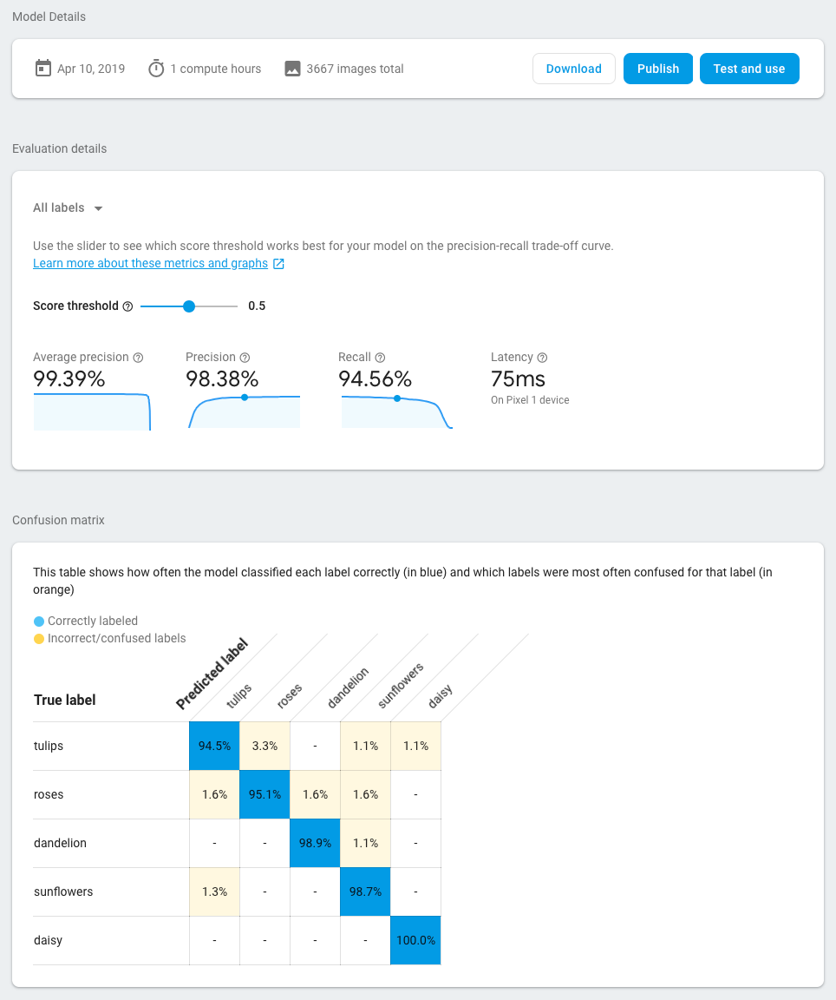
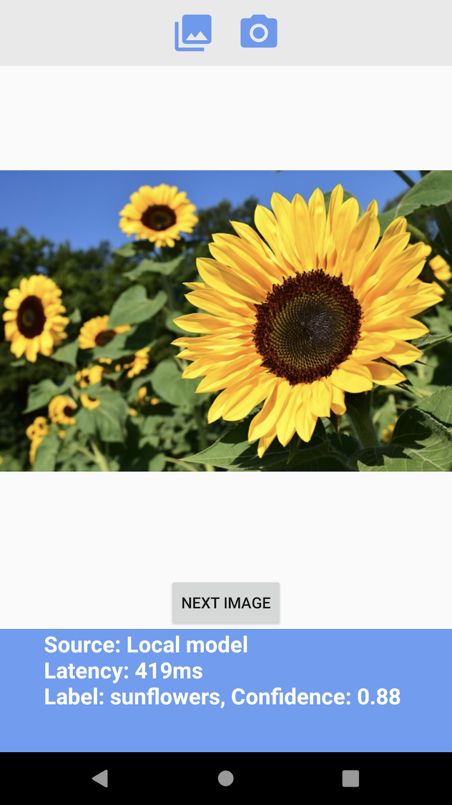
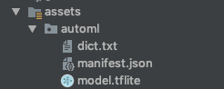
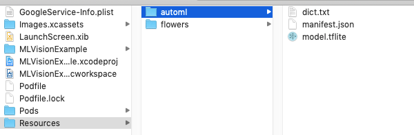
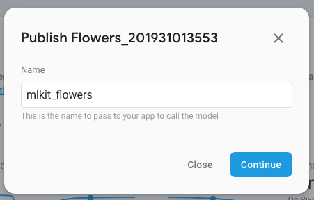
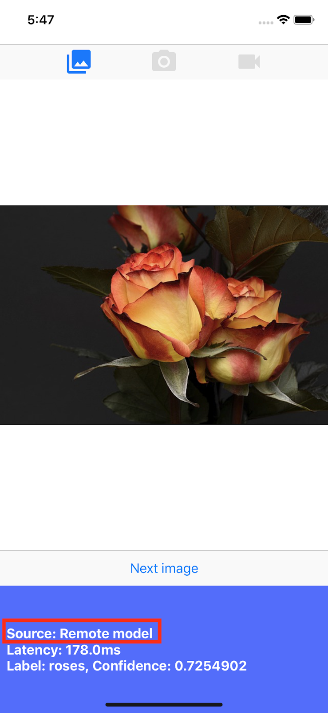

# [codelab] Train and deploy on-device image classification model with AutoML Vision in ML Kit

> Information can be found [here](https://codelabs.developers.google.com/codelabs/automl-vision-edge-in-mlkit).
>
> While Google could remove instructions, I copy/paste them below.

## About this codelab

Written by Khanh LeViet

## 1. Introduction

Recent progress in machine learning has made it relatively easy for computers to recognize objects in images. In this
codelab, we will walk you through an end-to-end journey building an image classification model that can recognize
different types of objects, then deploy the model on Android and iOS app. ML Kit and AutoML allow you to build and
deploy the model at scale without any machine learning expertise.

### What is ML Kit?

ML Kit is a mobile SDK that brings Google's machine learning expertise to Android and iOS apps in a powerful yet
easy-to-use package. Whether you're new or experienced in machine learning, you can easily implement the functionality
you need in just a few lines of code. There are several APIs that can recognize text, faces etc. that you can use
out-of-the-box. However, if you need to recognize objects that are not supported by the APIs, such as recognizing
different types of flowers from an image, then you need to train your own model. This is where AutoML can help you.

### What is AutoML?

Cloud AutoML is a suite of machine learning products that enables developers with limited machine learning expertise to
train high-quality models specific to their business needs, by leveraging Google's state-of-the-art transfer learning,
and Neural Architecture Search technology.

In this codelab, we will use AutoML Vision Edge in ML Kit to train a flower classification model. The model is trained
in the cloud, but is then bundled or downloaded by the app to run inferences fully on-device.


### What you'll learn

- How to train an image classification model using AutoML Vision Edge in ML Kit.
- How to run it in a sample Android or iOS app using the ML Kit SDK.

### What you'll need

#### For the Android app

- A recent version of Android Studio (v3.4+)
- [Android Studio Emulator with Play Store](https://developer.android.com/studio/run/managing-avds#system-image) or a
  physical Android device (v5.0+)
- Basic knowledge of Android development in Kotlin

#### For the iOS app

- A recent version of XCode (v10.2+)
- iOS Simulator or a physical iOS device (v9.0+)
- CocoaPods
- Basic knowledge of iOS development in Swift

## 2. Setup

### Download the code and training dataset

[Download a zip archive](https://github.com/googlecodelabs/automl-vision-edge-in-mlkit/archive/master.zip) that contains
the source code for this codelab and a training dataset. Extract the archive in your local machine.

> - There is an Android app and an iOS app provided in this codelab that have similar functionalities. You can choose
    > either platform that you are more familiar with to proceed.
> - The flower_photos.zip file in the archive is the training dataset that you will use in step 3: Prepare training dataset

### Create Firebase console Project

1. Go to the [Firebase console](https://console.firebase.google.com/).
2. Select **Create New Project**, and name your project "ML Kit Codelab."

### Setup the Android app

1. Add our Android app to the Firebase project. Android package name: `com.google.firebase.codelab.mlkit.automl`
2. Download the google-services.json config file, and put it in the Android app at
   `android/mlkit-automl/app/google-services.json`.

> - You don't need to import the project to Android Studio at this moment. Putting the `google-services.json`
    > in the right folder is enough.
> - You can safely ignore the rest of the setup instructions as the sample app has been properly set up.

### Setup the iOS app

1. Add our iOS app to the Firebase project. iOS bundle ID: `com.google.firebase.codelab.mlkit.automl`
2. Download the 3. GoogleService-Info.plist config file and follow the instructions to put it in the iOS app at
   `ios/mlkit-automl/GoogleService-Info.plist`.

> - You don't need to open the project in Xcode at this moment. Putting the `GoogleService-Info.plist` in the right folder is enough.
> - You can safely ignore the rest of the setup instructions as the sample app has been properly set up.

## 3. Prepare training dataset

To train a model to recognize different types of objects, you have to prepare a set of images and label each of them. We
have created an archive of creative-commons licensed flower photos for you to use in this codelab.

The dataset is packaged a zip file called `flower_photos.zip` that is included in the zip archive you downloaded in the
previous step.

### Explore the dataset

If you extract the `flower_photos.zip` file, you will see that the dataset contains images of 5 flower types: dandelion,
daisy, tulips, sunflowers and roses that are organized into folders named after the flowers. This is a handy way to
create a training dataset to feed to AutoML and train an image classification model.

There are 200 images for each flower type in this training dataset. You only need a minimum of 10 images per class to
train a model. However, more training images will generally lead to better models.




## 4. Train a model

### Upload training dataset

1. From [Firebase console](https://console.firebase.google.com/), open the project you just created.
2. Select ML Kit > AutoML.
3. You may see some welcome screens. Select Get Started where applicable.

> Note: You can stay on Spark plan (free) to try this codelab.

4. After the set up progress has finished, select Add dataset, and name it "Flowers".
5. In Model objective, choose Single-label classification, as the training data only contains one label per image.
6. Select Create.
7. Upload the `flower_photos.zip` file that you downloaded in the previous step to import the flower training dataset.
8. Wait a few minutes for the import task to finish.
9. Now you can confirm that the dataset is correctly imported. 10 .Because all images in the training dataset have been
   labeled, you can proceed to train a model.
   

### Train an image classification model

As our model will run on a mobile device with limited computing power and storage, we have to be mindful about not only
the model's accuracy but also its size and speed. There is always a trade off between model accuracy, latency (i.e how
long it takes to classify an image) and model size. Generally a model with higher accuracy is also larger and will take
longer to classify an image.

AutoML provides you several options: you can choose to optimize for accuracy, or to optimize for latency and model size,
or to balance between them. You also can choose how long you allow the model to train. Larger datasets need to train for
longer.



> Training a model may take up to **several hours**. If you do not want to wait, you can proceed to the next step and use a
> model that we have trained for you and included it in the Android and iOS sample apps.

Here are the steps if you want to train the model yourself.

1. Select Train model.
2. Select General purpose option and 1 compute hour training time.
3. Wait some time (probably several hours) for the training task to finish.
4. After the training task has finished, you will see evaluation metrics on how the trained model is performing.

> - There is always a trade off between model accuracy, latency (i.e how long it takes to classify an image) and model size.
    > Generally a model with higher accuracy is also larger and taking more time to classify an image.
> - Increasing training time can result in better accuracy to a certain limit, after which it will plateau.
> - You can experiment with multiple latency and package size options, as well as training time.
    > The default option (general purpose model and 1 compute hour) is a good starting point for a new dataset.



## 5. Use the model in mobile apps

### Preparation

- This codelab contains both Android and iOS sample app that demonstrates how to use the image classification model we
  trained earlier in a mobile app. The two apps have similar features. You can choose the platform that you are more
  familiar with.
- Before you proceed, please make sure that you have downloaded the sample apps and configured them in step 2.
- Please also make sure that your local environment has been set up to be able to build apps for the platform you have
  chosen (Android/iOS).

### Download image classification model

- If you have trained a model in the previous step, select Download to get the model.
- If you did not train a model or your training task has not finished yet, you can use the model that is included in the
  sample apps.

### Add the model to the sample app(s)

You only need to add the model to the sample apps and they will work out of the box. For a full guide on how to
integrate ML Kit AutoML to your app, please see our
documentation ( [Android](https://firebase.google.com/docs/ml-kit/android/label-images-with-automl)
, [iOS](https://firebase.google.com/docs/ml-kit/ios/label-images-with-automl)). Code that interacts with ML Kit SDK is
in the `ImageClassifier.kt` and `ImageClassifier.swift` file, respectively, so you can start from there to explore how
the apps work.

There are two options to deploy the model: local and remote.

- Local model is mainly used to bundle the image classification model in your app binary, although one can also provide
  a model saved in local storage. With bundling, the model is available immediately to your users after they download
  your app from App Store / Play Store, and it will work without internet connection.
- Remote model means the model is hosted on Firebase and will only be downloaded to your user's device when it is needed
  for the first time. After that, the model will also work offline.



#### Android app

1. Open Android Studio.
2. Import the Android app under `android/mlkit-automl/`
3. (Optional) Extract the model you have downloaded and copy its content over the model that is included in the sample
   app.

   

4. Now click Run ( c8b8a080b7ead886.png) in the Android Studio toolbar and verify that can recognize different types of
   flowers!

#### iOS app

1. Open Terminal and go to `ios/mlkit-automl/` folder
2. Run `pod install` to download dependencies via Cocoapods
3. Run `open MLVisionExample.xcworkspace/` to open the project workspace in Xcode.
4. (Optional) Extract the model you have downloaded and copy its content over the model that is included in the sample
   app under `ios/ml-automl/Resources/automl/`



5. Now click Run in the Xcode toolbar and verify that can recognize different types of flowers!

## 6. (Optional) Use remote model

ML Kit's remote model allows you to not include Tensorflow Lite models in your app binary but download it on-demand from
Firebase when needed. Remote models have several benefits over local models:

- Smaller app binary
- Being able to update models without updating the app
- A/B testing with multiple versions of a model

In this step, we will publish a remote model and use it in the sample apps. Please make sure that you have finished
training your model in step 4 of this codelab.

### Publish the model

1. Go to the Firebase console.
2. Select the "ML Kit AutoML Codelab" project that you created earlier.
3. Select ML Kit > AutoML.
4. Select the "Flowers" dataset you have created earlier.
5. Confirm that the training task has completed, then select the model.
6. Select Publish and name it "mlkit_flowers".



### Recognize flowers with the remote model

The sample apps are configured to use remote model if it is available. After you have published the remote model, you
only need to rerun the apps to trigger model download. You can verify that the app is using the remote model by looking
at the "Source" value in the footer of the app screen. See the "Troubleshooting" section below if it does not work.



### Troubleshooting

If the sample app is still using the local model, please verify that the remote model name is set correctly inside the
code.

#### Android app

1. Go to `ImageClassifier.kt` and find this block.

```kotlin
val remoteModel = FirebaseRemoteModel.Builder(REMOTE_MODEL_NAME).build()
```

2. Verify that the model name set in the code matched with the model name you published earlier via Firebase Console.
3. Now click Run in the Android Studio toolbar to rerun the app.

#### iOS app

1. Go to `ImageClassifier.swift` and find this block,

```swift
return RemoteModel(
name: Constant.remoteAutoMLModelName, allowsModelUpdates: true, initialConditions: initialConditions, updateConditions:
updateConditions
)
```

2. Verify that the model name set in the code matched with the model name you published earlier via Firebase Console
3. Now click Run in the Xcode toolbar to rerun the app.

## 7. Congratulations!

You have gone through an end-to-end journey of training an image classification model with your own training data using
AutoML, and then use the model in a mobile app using ML Kit.

Please see our [documentation](https://firebase.google.com/docs/ml-kit/automl-image-labeling) to learn how to integrate
AutoML Vision Edge in ML Kit to your own app.

You also can try our ML Kit sample apps to see other features of Firebase ML Kit.

### Android samples

- [Visions](https://github.com/firebase/quickstart-android/tree/master/mlkit)
- [Smart Reply](https://github.com/firebase/quickstart-android/tree/master/mlkit-smartreply)
- [Language Identification](https://github.com/firebase/quickstart-android/tree/master/mlkit-langid)

#### iOS samples

- [Visions](https://github.com/firebase/quickstart-ios/tree/master/mlvision)
- [Smart Reply](https://github.com/firebase/quickstart-ios/tree/master/smartreply)
- [Language Identification](https://github.com/firebase/quickstart-ios/tree/master/languageid)